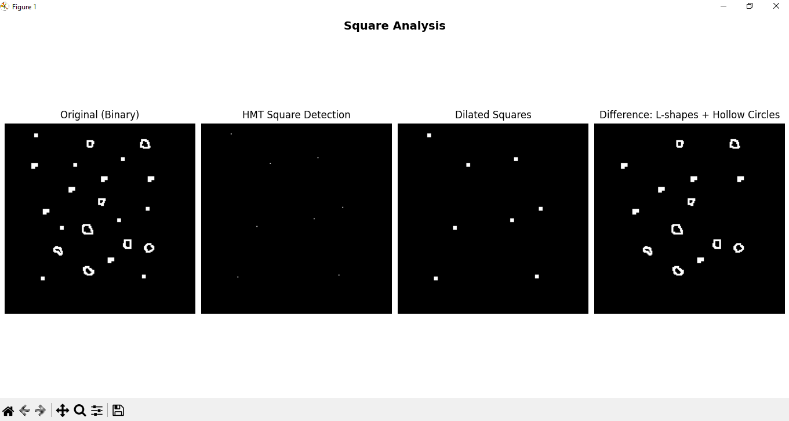
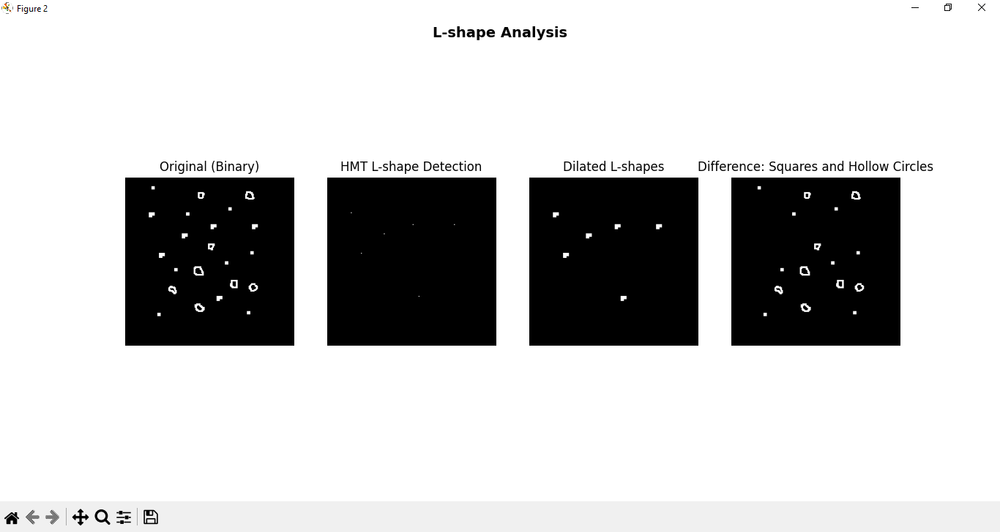
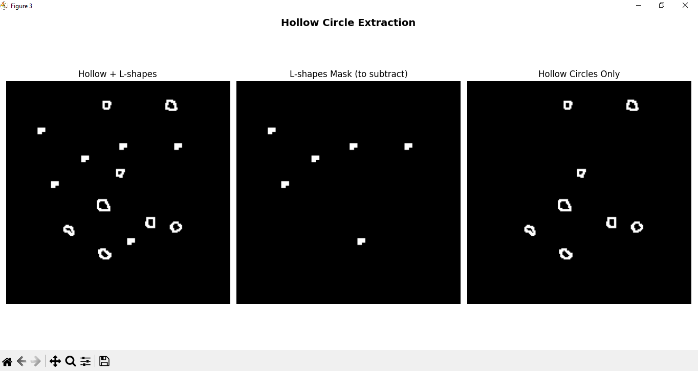

# Morphological Object Detection with Hit-or-Miss Transform

A computer vision exercise exploring morphological operations and the **Hit-or-Miss Transform (HMT)** for shape specific object detection and sequential pixel manipulation using OpenCV.

---

## Overview

This script processes a binary image (`Shapes1.bmp`) containing three distinct shape types **squares**, **L-shapes**, and **hollow circles**  and isolates each class using a pipeline of morphological operations. The core idea is to progressively subtract detected shapes from the original image until only the target objects remain.

---

## Pipeline

```
Original Image
      │
      ├──[HMT: square kernel]──► Square locations
      │         │
      │    [Dilate & subtract]
      │         │
      ▼         ▼
 Hollow + L-shapes
      │
      ├──[HMT: L-shape kernel]──► L-shape locations
      │         │
      │    [Reconstruct mask & subtract]
      │         │
      ▼         ▼
  Hollow Circles Only
```

---

## Key Concepts

### Binary Representation

The grayscale image is thresholded and converted to a `{0, 1}` binary image (`binary_01`) for use with OpenCV's morphological functions, which expect this format for HMT operations.

### Hit-or-Miss Transform (HMT)

HMT is a morphological operation that detects **exact local patterns** in a binary image. The kernel encodes three states:

| Value | Meaning                                 |
| ----- | --------------------------------------- |
| `+1`  | Foreground pixel must be present (hit)  |
| `-1`  | Background pixel must be present (miss) |
| `0`   | Don't care                              |

A pixel location is marked as a match only when **all** hit conditions and **all** miss conditions are satisfied simultaneously. This makes HMT far more selective than standard erosion or dilation.

```python
cv2.morphologyEx(binary_01, cv2.MORPH_HITMISS, kernel, anchor=(r, c))
```

---

## Sections

### Section 1 — Square Detection & Elimination

A 6×6 kernel with a solid `+1` interior and `-1` border is used to detect the **top-left anchor point** of each square. The anchor is set to `(1, 1)` to align the interior region correctly.

```
[-1, -1, -1, -1, -1, -1]
[-1,  1,  1,  1,  1, -1]
[-1,  1,  1,  1,  1, -1]
[-1,  1,  1,  1,  1, -1]
[-1,  1,  1,  1,  1, -1]
[-1, -1, -1, -1, -1, -1]
```

Once locations are found, each square's pixel region `[r:r+4, c:c+4]` is painted into a mask, which is subtracted from the original — leaving only L-shapes and hollow circles.



---

### Section 2 — L-Shape Detection & Elimination

A 6×7 kernel detects the **L-shape pattern** (filled rectangle with a missing bottom-right corner). The anchor is at `(0, 0)` so the detection point corresponds to the top-left of the shape.

```
[ 1,  1,  1,  1,  1,  1,  1]
[ 1,  1,  1,  1,  1,  1,  1]
[ 1,  1,  1,  1,  1,  1,  1]
[ 1,  1,  1,  1,  1,  1,  1]
[ 1,  1,  1,  1, -1, -1, -1]
[ 1,  1,  1,  1, -1, -1, -1]
```

Rather than using HMT output directly as a mask (which would only mark single pixels), the L-shape geometry is **reconstructed** by painting the correct pixel region for each detected location using a binary shape mask. This "dilation by shape" approach recovers the full object footprint before subtraction.



---

### Section 3 — Hollow Circle Isolation

After the two subtraction steps, hollow circles are obtained by:

```python
hollow_only = cv2.subtract(diff_no_squares, recovered_l_shapes_255)
```



This works because `diff_no_squares` already contains only L-shapes and hollow circles, so subtracting the reconstructed L-shape mask leaves the hollow circles in isolation.

---

## Observations

- **HMT is highly sensitive to kernel design.** A kernel that is even slightly misaligned with the actual shape dimensions in the image will produce zero detections. Correct anchor placement is equally critical.
- **HMT output marks anchor points, not full shapes.** To eliminate detected objects, their pixel regions must be explicitly reconstructed and painted into a subtraction mask.
- **Sequential subtraction** is an effective strategy when shapes are non-overlapping and their kernels are well-defined.
- `cv2.subtract` handles clipping automatically (no negative values), making it safe for mask-based elimination on `uint8` images.

---

## Dependencies

```
opencv-python
numpy
matplotlib
```

---

## Usage

```bash
python solution.py
```

Place `Shapes1.bmp` inside an `images/` directory relative to the script. Three figure windows will be displayed showing the analysis for squares, L-shapes, and the final hollow circle extraction.
